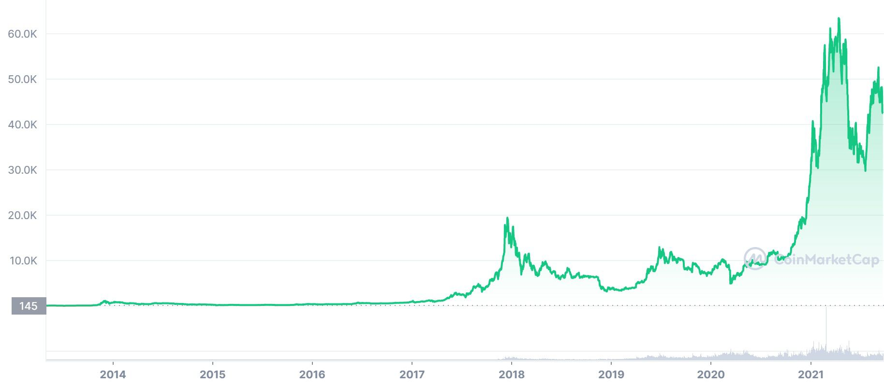

## Bitcoin- historia

Koncepcja powstania zdecentralizowanego systemu płatności znacznie przybrała na popularności podczas kryzysu finansowego z lat 2008-2009. O Bitcoinie zaczęło być głośno w październiku 2008, kiedy Satoshi Nakamoto (anonimowy twórca BTC) przedstawił i opisał metody wykorzystania sieci peer-to-peer (P2P) w celu stworzenia "systemu elektronicznych transakcji nieopartych jedynie na wzajemnym zaufaniu". Bitcoiny nie posiadają swojego fizycznego odpowiednika, nie są namacalnym obiektem - można je raczej nazwać zbiorem linijek kodu. Każdy pojedynczy BTC posiada swój własny, unikatowy kod a o jego wartości decydują ludzie.

## Historia kursu Bitcoina

Na początku kurs BTC rósł systematycznie, lecz z niekiedy z pewnymi kryzysami. W 2013 przekroczył 1000 USD i przez następne kilka lat utrzymywał się w takiej wartości. Znacząco się wybił pod koniec 2017 roku, kiedy w niedługim czasie osiągnął 20 tysięcy dolarów. Następnie spadł i wartość 20 tysięcy osiągnął dopiero w grudniu 2020, wtedy jednak zaczął się niesamowicie gwałtowny wzrost,  już w kwietniu 2021 cena jednego bitcoina wyniosła 65 000 USD. Obecnie jego kurs to 1 BTC = 43500 USD = 186 000 PLN

## Ciekawostki

W Salwadorze Bitcoin jest oficjalną walutą  
Z drugiej strony, niektóre państwa w pełni zdelegalizowały kryptowaluty. Są to między innymi Chiny, Egipt, czy Turcja.  
W 2010 roku programista Laszlo Haneycz zapłacił 10 tys. BTC za 2 pizze w restauracji Papa John's Pizza, co wtedy stanowiło wartość ok. 30 dolarów. Obecnie byłyby to 43 miliony dolarów.

